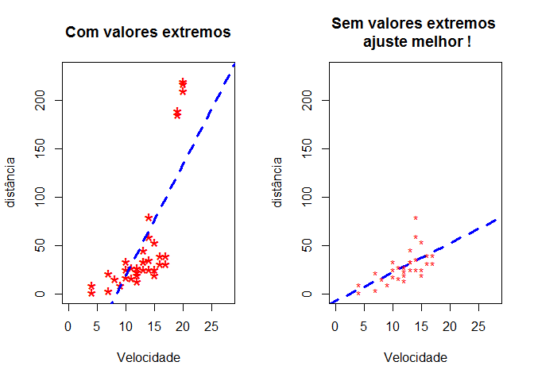
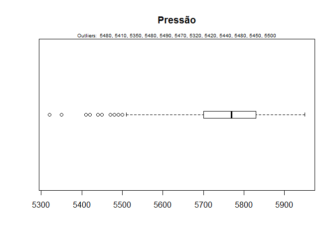
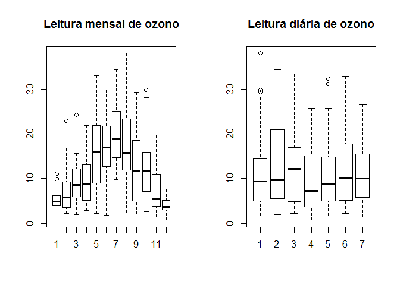
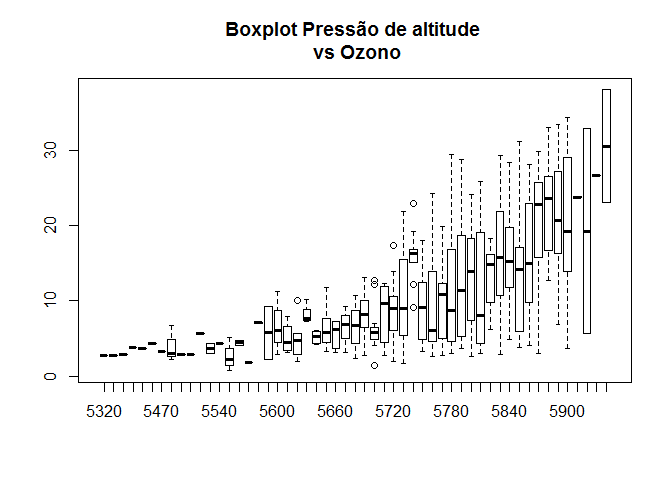
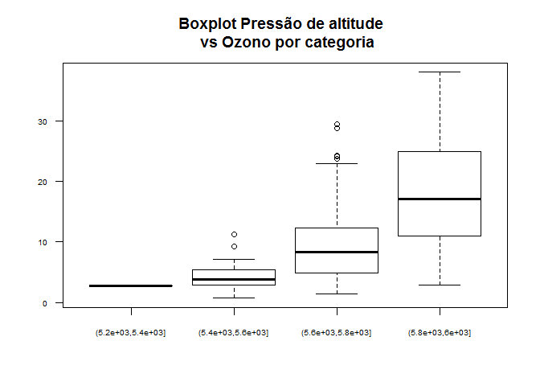
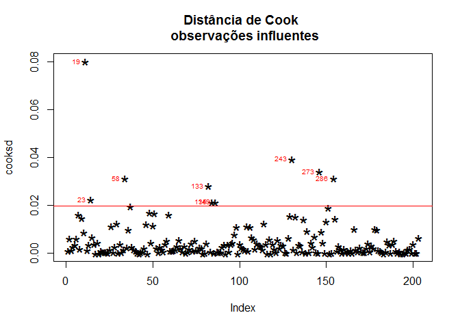

##Deteção e tratamento de outliers


Artigo original de Selva Prabhakaranon December 9, 2016 em <http://r-statistics.co/Outlier-Treatment-With-R.html>, traduzido e modificado para uma melhor compreensão do tema.

**Outliers ou valores extremos ou valores discrepantes, são aqueles valores de uma amostra que se afastam significativamente do comportamento estatístico dos restantes.** 

Outliers podem prejudicar a acurácia dos dados e introduzir erros no AED e nas predições se não são detectados e tratados em forma conveniente, especialmente quando se trata de modelos de regressão.

Cual a importância da detecão e tratamento de valores extremos?
O tratamento ou modificação de valores extremos em observações que consideramos corretamente registradas, não é uma operação comum. Eles podem ter um impacto significativo nos modelos de regressão ou nas estatísticas descritivas dos dados.

O analista deve decidir acorde seu critério, como tratar os valores discrepantes
A identificação de valores extremos é de extrema importância e vamos mostrar o efeito no seguinte exemplo, usando a base de dados do R **cars**. 
Para isso vamos criar dois conjuntos de dados, um deles sem valores discrepantes e no segundo vamos introduzir valores extremos, na sequência calculamos uma regressão simples em ambos e graficamos os resultados.

---


```r
library(datasets)
# primeiro conjunto, dados originais.
cars1 <-  cars[1:30,] 
# criação dos outliers e do segundo conjunto
cars_outliers <-  data.frame(speed=c(19,19,20,20,20), 
                             dist=c(190, 186, 210, 220, 218)) # introduze outliers.
cars2<- rbind(cars1, cars_outliers) 

# Grafico 1, com valores discrepantes
par(mfrow = c (1, 2))
plot(cars2$speed, cars2$dist, 
     xlim = c(0, 28), 
     ylim = c(0, 230), 
     main = "Com valores extremos", 
     xlab = "Velocidade", ylab="distância", 
     pch="*", col="red", cex=2)

# linha de regresssão 
abline(lm(dist ~ speed, data=cars2), 
       col = "blue", 
       lwd = 3, 
       lty = 2)

# Gráfico 2, valores originais
plot(cars1$speed, cars1$dist, 
     xlim = c(0, 28), 
     ylim = c(0, 230), 
     main = "Sem valores extremos \n ajuste melhor !", 
     xlab = "Velocidade", 
     ylab = "distância", pch="*", col="red", 
     cex = abline(lm(dist ~ speed, data=cars1), 
                col = "blue", 
                lwd = 3, 
                lty = 2))
```

<!-- -->

---

Note a mudança na inclinação da linha de regressão, se tivéssemos usado os outliers, as predições baseadas nesses dados seriam exageradamente grandes em relação ao segundo gráfico.

---

####Detecção de valores extremos - caso univariado.

Para uma variável contínua, os valores extremos são aqueles que caem fora do intervalo IQ X 1.5, ou seja, uma vez e meia maiores ou menores que o Intervalo InterQuartílico (diferença entre o quartil de 75% e do 25%). Nos gráficos de boxplot ele se representa por uma linha chamada "cerca".

Vamos usar uma base de dados pública de medição de ozono


```r
url <- "http://rstatistics.net/wp-content/uploads/2015/09/ozone.csv"
ozone <- read.csv(url) # importar dados

outlier_values <- boxplot.stats(ozone$pressure_height)$out # valores extremos

boxplot(ozone$pressure_height, main="Pressão", boxwex=0.1, horizontal = T)

mtext(paste("Outliers: ", paste(outlier_values, collapse=", ")), cex=0.6)
```

<!-- -->

---

####Detecção de valores extremos - caso bi-variado.


```r
par(mfrow=c(1, 2))
# Variável categórica, nesse caso vamos usar os dados separados por mês
boxplot(ozone_reading ~ Month, 
        data = ozone, 
        main = "Leitura mensal de ozono")  # Se nota um padrão mensal claramente.

# agora os dados diários
boxplot(ozone_reading ~ Day_of_week, 
        data = ozone, 
        main = "Leitura diária de ozono")  
```

<!-- -->

```r
# Não presenta padrão, já que a semana é um subconjunto do mês
```

---

O que podemos inferir? 

que a variação ao longo dos meses tem um padrão significativo enquanto nos dias da semana não. Os outliers em cada categoria se apresentam fora das cercas respectivas.

---

Para variáveis contínuas


```r
boxplot(ozone_reading ~ pressure_height, 
        data = ozone, 
        main = "Boxplot Pressão de altitude \n vs Ozono")
```

<!-- -->

```r
boxplot(ozone_reading ~ cut(pressure_height, pretty(ozone$pressure_height, n=4)), 
        data = ozone, 
        main = "Boxplot Pressão de altitude  \n vs Ozono por categoria", 
        cex.axis = 0.6, 
        las = 1)
```

<!-- -->


Nota-se alguns poucos outliers no boxplot e como as leitura de ozono aumentam com a pressão da altitude.

---

####Modelo multi-variado

Definir um valor como extremo, baseado apenas em uma (às vezes sem muita importância) caraterística, pode levar a conclusões fora da realiade. Quando decidimos que um valor individual (representado por uma linha ou uma observação) é um valor extremo, temos de analisar o conjunto de observações que interessa, aí que entra a distância de Cook.

---

####Distância de Cook

Essa distância é uma medida calculada respeito de um modelo de regressão e por tanto, é influenciada apenas pelas variáveis explicativas incluídas no modelo. 

O que significa a distância de Cook? 

Ela calcula a influência exercida por linha (e por conseguinte por todas as variáveis explicativas, X) na saída predita pelo modelo. A distância de Cook para cada observação _i_, mede a mudanca em Y (Y ajustado) para todas as observações e também para todas excluindo _i_, de forma de medir o impacto da observação _i_ nos valores ajustados ou preditos.
 
Matematicamente a **fórmula da distância de Cook** é:


$$ D_i = \frac{\sum_{j=1}^{n} ( \hat{Y}_{j} - \hat{Y}_{j-(i)})^2} {p * EMQ} $$ 


onde $\hat{Y_j}$ é o valor ajustado com todas as observações e $\hat{Y_{j(i)}}$ é o valor ajustado sem a observação _i_.

_EMQ_ é o erro médio quadrático e _p_ o número de coeficientes do modelo de regressão.

---

####Influência das medições

Em geral, as observações que tem uma distância superior a 4 vezes a média, **podem** ser classificadas como influentes, o que não é um limite muito rigoroso.

Vamos calcular as distâncias no modelo gerado pela variável "ozone_reading" como resposta, e todas as demais do conjunto de dados "ozone" como variáveis explicativas.


```r
# geramos o modelo
mod <- lm(ozone_reading ~ ., data=ozone)

# calculamos as dist?ncias..
cooksd <- cooks.distance(mod)
```

---

Graficamos as distâncias calculadas e identificamos as mais influentes.

---


```r
plot(cooksd, 
     pch  = "*", 
     cex  = 2, 
     main = "Distância de Cook \n observações influentes")

abline(h = 4*mean(cooksd, na.rm=T), col="red")  # Linha de corte de 4 m?dias

# aquelas observações além da linha de corte são identificadas
text(x=1:length(cooksd)+1, y=cooksd, 
     labels=ifelse(cooksd>4*mean(cooksd, na.rm=T),
                   names(cooksd),""), col="red", cex=0.6, pos=2)  # add labels
```

<!-- -->

---


```r
influential <- as.numeric(names(cooksd)[(cooksd > 4*mean(cooksd, na.rm=T))])  # número das linhas que mais influênciam

head(ozone[influential, ],10)  # 10 primeiras influentes
```

```
##     Month Day_of_month Day_of_week ozone_reading pressure_height
## 19      1           19           1          4.07            5680
## 23      1           23           5          4.90            5700
## 58      2           27           5         22.89            5740
## 133     5           12           3         33.04            5880
## 135     5           14           5         31.15            5850
## 149     5           28           5          4.82            5750
## 243     8           30           1         37.98            5950
## 273     9           29           3          4.60            5640
## 286    10           12           2          7.00            5830
##     Wind_speed Humidity Temperature_Sandburg Temperature_ElMonte
## 19           5       73                   52               56.48
## 23           5       59                   69               51.08
## 58           3       47                   53               58.82
## 133          3       80                   80               73.04
## 135          4       76                   78               71.24
## 149          3       76                   65               51.08
## 243          5       62                   92               82.40
## 273          5       93                   63               54.32
## 286          8       77                   71               67.10
##     Inversion_base_height Pressure_gradient Inversion_temperature
## 19                    393               -68                 69.80
## 23                   3044                18                 52.88
## 58                    885                -4                 67.10
## 133                   436                 0                 86.36
## 135                  1181                50                 79.88
## 149                  3644                86                 59.36
## 243                   557                 0                 90.68
## 273                  5000                30                 52.70
## 286                   337               -17                 81.14
##     Visibility
## 19          10
## 23         150
## 58          80
## 133         40
## 135         17
## 149         70
## 243         70
## 273         70
## 286         20
```

---

Examinando as 9 linhas identificadas podemos ver o seguinte

Linhas 23, 58, 135, 149 e 273, tem valores extremos na variável "Inversion_base_height".

Linha 19 tem valores baixos em "Pressure_gradient".

Linha 243 tem alto valor em "Inversion_temperature".

Verificar os restantes...

---

####Teste de valores extremos
A função **outlierTest** do pacote **car** nos informa o valor mais extremo de um modelo escolhido.

Vejamos o exemplo com o modelo que criamos.


```r
car::outlierTest(mod)
```

```
## 
## No Studentized residuals with Bonferonni p < 0.05
## Largest |rstudent|:
##     rstudent unadjusted p-value Bonferonni p
## 243 3.045756          0.0026525      0.53845
```

---

A saída nos informa que o registro ou linha 243 é o valor mais extremo.

---

####Pacote outliers

**outliers package 2006, Komsta, L. (2006). Processing data for outliers. R News, 6(2), 10-13**.

Esse pacote tem várias funções úteis para extrair em forma automática os valores extremos. Alguns como
**outlier()** e **scores()** são muito apropriadas para este propósito, vamos ver elas.

---

**outliers**

A função retorna o valor mais extremo a partir da média, se colocamos o argumento _opposite=TRUE_, 
nos retorna o valor oposto. Vejamos exemplo com valores aleatórios:


```r
library(outliers)
set.seed(1234)
y  <-  rnorm(100)

paste0("média do vetor = ", round( mean(y), 4))
```

```
## [1] "média do vetor = -0.1568"
```

```r
print("extremos do vetor")
```

```
## [1] "extremos do vetor"
```

```r
outlier(y)
```

```
## [1] 2.548991
```

```r
outlier(y,opposite=TRUE)
```

```
## [1] -2.345698
```

```r
dim(y) <- c(20,5)  # convertemos o vetor em matriz

print("média da matriz")
```

```
## [1] "média da matriz"
```

```r
colMeans(y)
```

```
## [1] -0.2506641 -0.5770699 -0.4443309  0.2871451  0.2011111
```

```r
print("extremos do vetor")
```

```
## [1] "extremos do vetor"
```

```r
outlier(y)
```

```
## [1] 2.415835 1.102298 1.647817 2.548991 2.121117
```

```r
print("extremos opostos do vetor")
```

```
## [1] "extremos opostos do vetor"
```

```r
outlier(y,opposite=TRUE)
```

```
## [1] -2.345698 -2.180040 -1.806031 -1.390701 -1.372302
```

---

####Score, pontuação ou razão

A função  **scores()** tem duas importantes funções.

Calcular o score normalizado, baseados nas distribuições z, t, chisq...etc; e

encontrar as observações que ficam além de um dado percentile de um determinado score. O retorno da função é um vetor lógico que pode ser usado para retirar os valores requeridos.

---


```r
set.seed(1234)
x = rnorm(10)
scores(x)                           # z-scores => (x-mean)/sd
```

```
##  [1] -0.8273937  0.6633811  1.4738069 -1.9708424  0.8157183  0.8929749
##  [7] -0.1923930 -0.1641660 -0.1820615 -0.5090247
```

```r
scores(x, type = "chisq")             # chi-sq scores => (x - mean(x))^2/var(x)
```

```
##  [1] 0.68458034 0.44007451 2.17210689 3.88421971 0.66539631 0.79740421
##  [7] 0.03701507 0.02695047 0.03314640 0.25910611
```

```r
scores(x, type = "t")                 # t scores
```

```
##  [1] -0.8115497  0.6413175  1.5952995 -2.4645688  0.7991765  0.8818782
##  [7] -0.1817640 -0.1550094 -0.1719662 -0.4869741
```

```r
scores(x, type = "chisq", prob = 0.9)   # além do 90%-ile distribuição chi-sq
```

```
##  [1] FALSE FALSE FALSE  TRUE FALSE FALSE FALSE FALSE FALSE FALSE
```

```r
scores(x, type = "chisq", prob = 0.95)  # al?m do 95%-ile distribuição chi-sq
```

```
##  [1] FALSE FALSE FALSE  TRUE FALSE FALSE FALSE FALSE FALSE FALSE
```

```r
scores(x, type ="z", prob = 0.95)      # al?m do 95%-ile distribuição z-scores
```

```
##  [1] FALSE FALSE FALSE  TRUE FALSE FALSE FALSE FALSE FALSE FALSE
```

```r
scores(x, type ="t", prob = 0.95)      # al?m do 95%-ile distribuição t-scores
```

```
##  [1] FALSE FALSE FALSE  TRUE FALSE FALSE FALSE FALSE FALSE FALSE
```

```r
# por exemplo, vamos retirar o valor da amostra "x" que está além do 95%-ile
x[scores(x, type="chisq", prob=0.95)]
```

```
## [1] -2.345698
```


---


#### Tratamento dos outliers ou valores extremos

Uma vez indentificados os valores extremos é sua responsabilidade decidir que vai fazer com eles, baseado
na natureza de seus dados, na sua experiência e o bom senso.

Diversas aproximações podemos usar nesse problema:

1. **Manter os valores**. 

Os valores extremos são legítimos e pertencen ao conjunto de dados, eles representam alguma caraterística dos dados que não pode ser eliminada a risco de produzir resultados de baixa qualidade ou mesmo ruins.


2. **Imputar valores**.

Em caso principalmente de valores faltantes (NAs), pode-se imputar ou colocar um valor determinado. 

Os valores mais usados nesse caso são alguma das estatísticas como a média/mediana/moda. 

Um pacote útil para imputação de dados em bases de dados grandes e complexas, é o **"missMDA"**, <http://math.agrocampus-ouest.fr/infoglueDeliverLive/developpement/missMDA>. Ele permite imputar dados em caso de análise  de dados multivariado.


3. **Cobertura (capping)**

Se os valores estão fora do limite de 1.5 * IQ, podemos substituir os valores por baixo do limite pelo valor do 5%-ile e os valores que caem fora do limite superior com o 95%-ile. O código que realiza essa substituição é:


```r
(x <- ozone$pressure_height)
```

```
##   [1] 5480 5660 5710 5700 5760 5720 5790 5790 5700 5700 5770 5720 5760 5780
##  [15] 5830 5870 5840 5780 5680 5720 5760 5730 5700 5650 5680 5780 5820 5830
##  [29] 5810 5790 5800 5820 5770 5670 5590 5410 5350 5480 5600 5490 5560 5700
##  [43] 5680 5700 5650 5610 5730 5770 5770 5700 5690 5700 5730 5690 5640 5720
##  [57] 5740 5740 5740 5670 5550 5470 5320   NA 5530 5600 5660 5580 5510 5530
##  [71] 5620 5690 5760 5740 5780 5790 5760 5700 5680 5720 5720 5730 5710 5750
##  [85] 5720 5710 5600 5630 5690 5730 5710 5610 5680 5620 5420 5540 5590 5690
##  [99] 5550 5620 5630 5580 5560 5440 5480 5620 5450 5660 5680 5760 5790 5720
## [113] 5660 5710 5780 5750 5700 5620 5650 5730 5810 5790 5740   NA 5690   NA
## [127] 5680 5650 5730 5730 5760 5830 5880 5890 5850 5820   NA 5800 5740 5710
## [141] 5720 5710 5740 5720 5690 5730 5780 5790 5750 5680 5720 5770 5800 5780
## [155] 5740 5730 5760 5770 5690 5650 5610 5570 5690 5760 5810 5830 5880 5860
## [169] 5830 5870 5860 5800 5800 5770 5860 5870 5870 5860 5880 5870 5860 5830
## [183] 5820 5820 5860 5870 5890 5900 5890 5890 5910 5900 5860 5830 5850 5830
## [197]   NA 5810 5830 5830 5840 5870 5870 5850 5860 5900 5890 5880 5890 5870
## [211]   NA   NA 5820 5780 5770 5790 5820 5840 5800 5830 5800 5840   NA 5910
## [225] 5890 5870 5780 5730 5780 5750 5760 5730 5730 5790 5750 5880 5890 5880
## [239] 5870 5900 5920 5930 5950 5950 5900 5890 5860 5840 5800 5760 5810 5850
## [253]   NA   NA 5760 5860 5830 5840 5800   NA 5790 5830 5810 5770 5780 5800
## [267] 5770 5800 5780 5790 5770 5750 5640 5640 5650 5710 5760 5840 5880 5890
## [281] 5890 5890 5890 5850 5830 5830 5860 5830 5800 5830 5790 5730 5780 5740
## [295] 5710 5690 5670 5760 5820 5790 5760 5800 5810 5750 5840 5860 5870 5920
## [309] 5900 5860 5840 5840 5850 5810 5770 5710 5500 5660 5700 5810 5860 5900
## [323] 5850 5780 5790 5780 5770 5750 5780 5790 5750 5670 5760 5770 5810 5810
## [337] 5870 5830 5760 5680 5780 5810 5760 5680 5750 5790 5770 5750 5720 5760
## [351] 5780 5660 5610 5640 5680 5650 5710 5680 5630 5770 5800 5730 5690 5650
## [365] 5550   NA
```

```r
summary(x)
```

```
##    Min. 1st Qu.  Median    Mean 3rd Qu.    Max.    NA's 
##    5320    5700    5770    5753    5830    5950      12
```

```r
(qnt <-  quantile(x, probs = c(.25, .75), na.rm = T))
```

```
##  25%  75% 
## 5700 5830
```

```r
(caps <- quantile(x, probs = c(.05, .95), na.rm = T))
```

```
##   5%  95% 
## 5550 5890
```

```r
(H <-  1.5 * IQR (x, na.rm = T))
```

```
## [1] 195
```

```r
(x[x < (qnt[1] - H)] <- caps[1])
```

```
##   5% 
## 5550
```

```r
(x[x > (qnt[2] + H)] <- caps[2])
```

```
##  95% 
## 5890
```

```r
summary(x)
```

```
##    Min. 1st Qu.  Median    Mean 3rd Qu.    Max.    NA's 
##    5510    5700    5770    5757    5830    5950      12
```


3. Predição

Uma outra forma de contornar o problema é substituir esses valores considerando-os como variáveis resposta e predecindo um valor para eles(outro tema a ser considerado).

---

---

Fim do tutorial Detecção de Valores Extremos

---


```r
#library(packrat)
sessionInfo()
```

```
## R version 3.4.0 (2017-04-21)
## Platform: x86_64-w64-mingw32/x64 (64-bit)
## Running under: Windows 10 x64 (build 14393)
## 
## Matrix products: default
## 
## locale:
## [1] LC_COLLATE=Portuguese_Brazil.1252  LC_CTYPE=Portuguese_Brazil.1252   
## [3] LC_MONETARY=Portuguese_Brazil.1252 LC_NUMERIC=C                      
## [5] LC_TIME=Portuguese_Brazil.1252    
## 
## attached base packages:
## [1] stats     graphics  grDevices utils     datasets  methods   base     
## 
## other attached packages:
## [1] outliers_0.14
## 
## loaded via a namespace (and not attached):
##  [1] Rcpp_0.12.14       knitr_1.18         magrittr_1.5      
##  [4] splines_3.4.0      MASS_7.3-48        lattice_0.20-35   
##  [7] minqa_1.2.4        stringr_1.2.0      car_2.1-6         
## [10] tools_3.4.0        nnet_7.3-12        pbkrtest_0.4-7    
## [13] parallel_3.4.0     grid_3.4.0         nlme_3.1-131      
## [16] mgcv_1.8-21        quantreg_5.33      MatrixModels_0.4-1
## [19] htmltools_0.3.6    yaml_2.1.16        lme4_1.1-15       
## [22] rprojroot_1.2      digest_0.6.14      Matrix_1.2-11     
## [25] nloptr_1.0.4       evaluate_0.10.1    rmarkdown_1.8     
## [28] stringi_1.1.5      compiler_3.4.0     backports_1.1.0   
## [31] SparseM_1.77
```

```r
#save(list = ls(), file = "outliers_all.Rdata")
```
