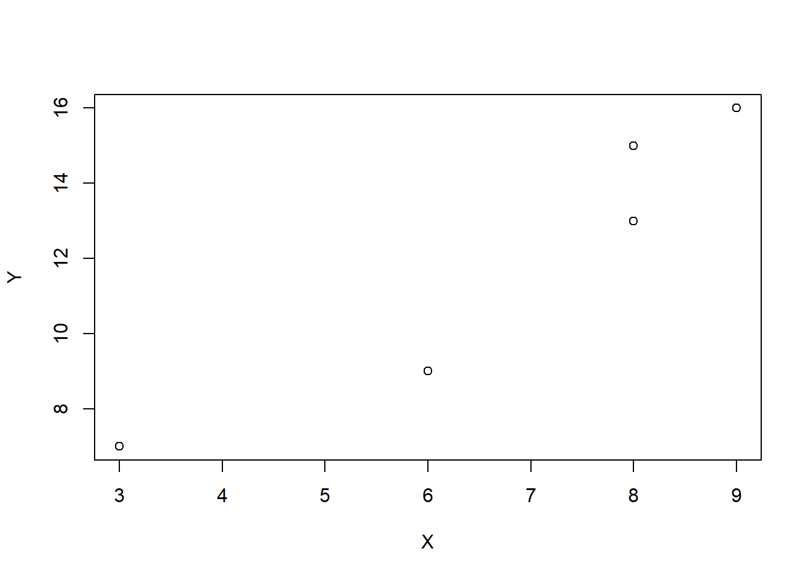
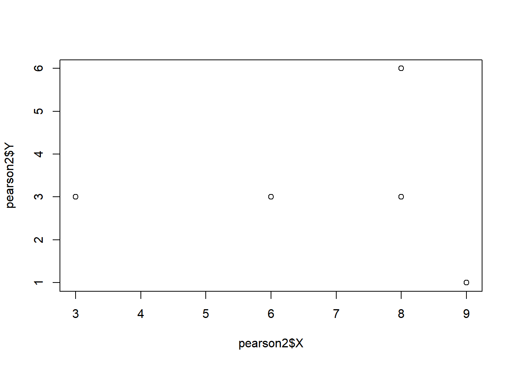
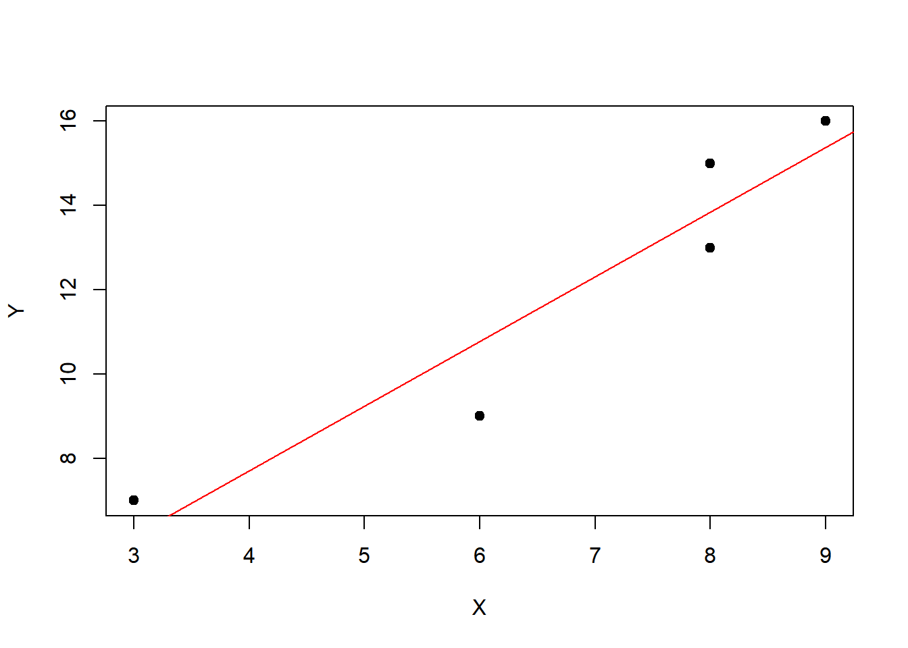
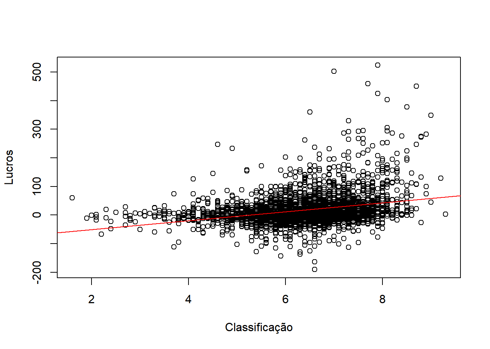
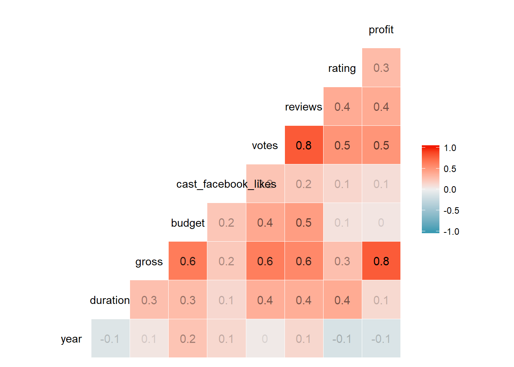
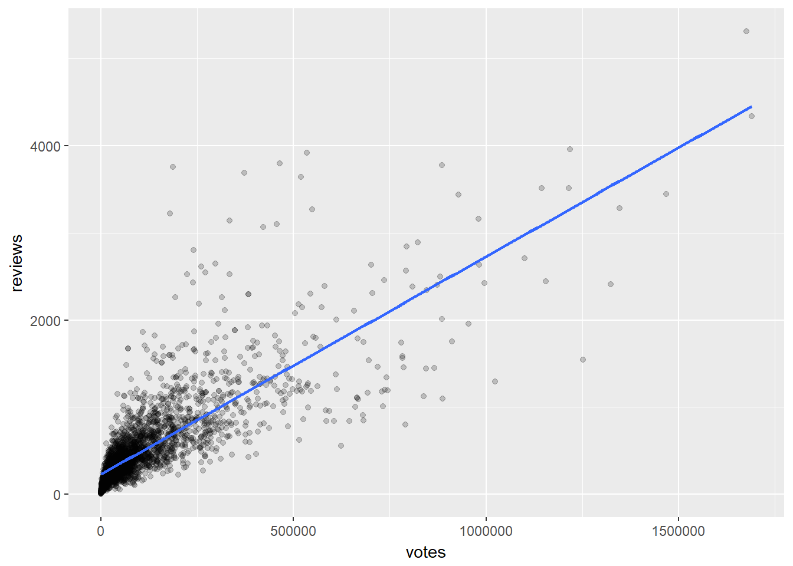
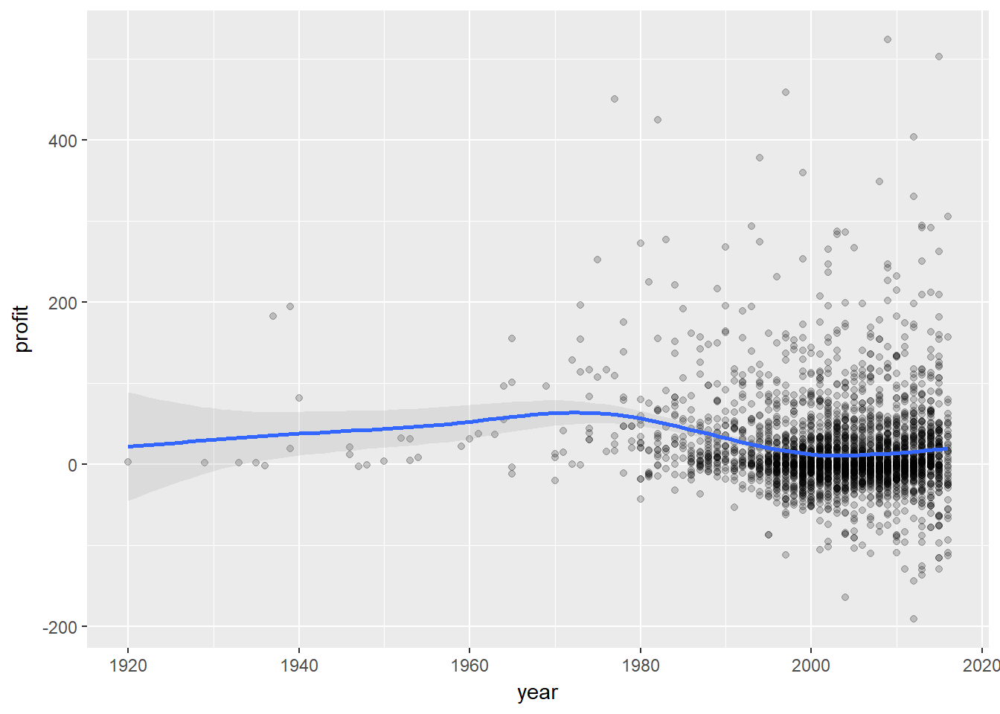
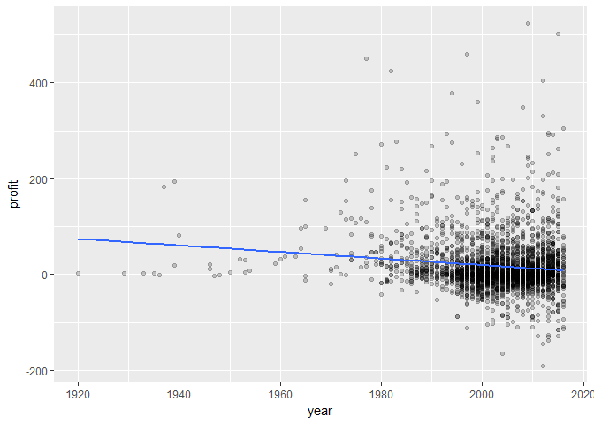
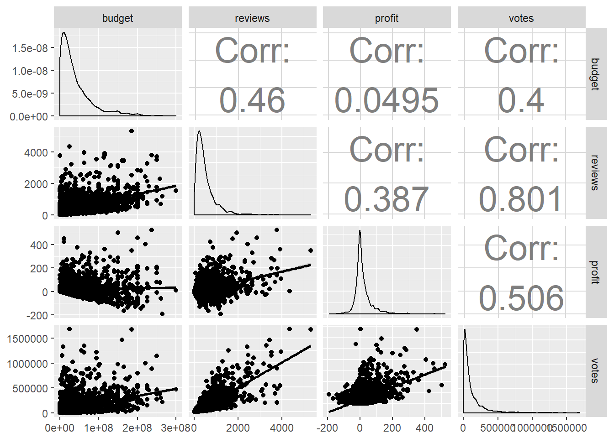
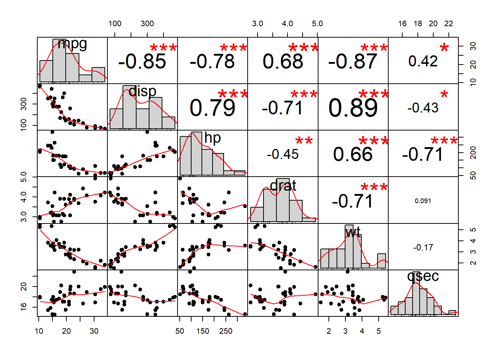

---

## Tutorial de correlação e regressão

---

Parte deste material encontra-se em (<https://www.datacamp.com/>) e em "Online Statistics Education" (<http://onlinestatbook.com/>), sendo de livre acesso (open source). Foi traduzido ao português para melhor difussão, e feitas pequenas modificações nos fragmentos de código.

### Correlação

#### Alguns conceitos teóricos

**Correlação é uma medida de dependência ou associação entre duas variáveis.**

**Correlação** é apenas uma relação estatística, por isso sempre se deve ter em mente que a correlação entre duas variáveis não significa que uma seja a causa da outra, outros testes e medições devem ser feitos para confirmar essa hipótese.

Pode ainda existir forte dependência entre duas variáveis sem ter correlação.

Existem diferentes coeficientes de correlação, um dos mais usados é o coeficiente de correlação de Pearson. 

O coeficiente de Pearson varia desde o valor **1**, quando as variáveis são perfeita e positivamente correlacionadas, ou seja variam no mesmo sentido;  a **0** quando não existe nenhum tipo de correlaçãon até **-1** quando elas são perfeita e negativamente correlacionadas ou seja variam em sentidos opostos.

Como a correlacao calcula-se entre cada dois pares de elementos de cada variavel, nao faz sentido se algum elemento das variaveis esta faltando ou seja é NA. Por isso o calculo so pode ser feito sobre variaveis completas, sem NAs. Vamos ver alguns exemplos de correlação, sendo que voltaremos a analisa-la num exercicio posterior.

---

**Correlação positiva entre 1 e 0 aprox.:**

<center></center>


---

**Correlação negativa entre -1 e 0 aprox.:**

<center></center>

---

#### Calculo da correlação

Com a finalidade de entender como a correlação e calculada, vamos definir duas variaveis com apenas 5 elementos cada, "X" e "Y" e coloca-las num dataframe. Veja que como as duas variaveis crescem, a correlação independentemente do seu valor, deveria ser positiva.


```r
X <- c(3,6,8,8,9)
Y <- c(7,9,13,15,16)
plot(X,Y)
```



```r
pearson <- data.frame(X,Y)
```

---

Como primeiro passo, vamos calcular a media de cada variavel.


```r
mediax <- mean(X)
mediay <- mean(Y)
```

Na sequencia vamos substrair de cada variavel, o valor a media e adicionamos uma nova coluna ("x","y"). Este numero representa o desvio de cada valor do centro da variavel. O calculo sera repetido para a variavel "Y". Para o calculo e a atualização do dataframe usaremos a funcao _mutate_ do pacote _dplyr_. O sumatorio das novas variaveis "x" e "y", deve ser sempre zero.


```r
library(dplyr)
pearson <- mutate(pearson, x = X - mediax, y = Y - mediay)
round(sum(pearson$x),1)
```

```
## [1] 0
```

```r
round(sum(pearson$y),1)
```

```
## [1] 0
```

---

No seguinte passo, multiplicamos as colunas criadas. 


```r
pearson$xy <- pearson$x * pearson$y
```

Esta nova coluna revela coisas interessantes sobre o comportamento das variaveis e sua correlacao. No caso de nao existir correlacao, os valores de "x" e "y" seriam tanto positivos como negativos nas mesmas linhas e seu somatorio deveria ser um numero muito pequeno. 

Ja no caso de existir correlacao, o sumatorio deve dar um numero maior, ja que as diferencas com a media seram simultaneamente positivas ou negativas.


```r
sum(pearson$xy)
```

```
## [1] 35
```

---

Finalmente vamos adicionar duas novas colunas, com o quadrado de cada variavel, "x" e "y", ou seja a variancia de cada uma delas.


```r
pearson <- mutate(pearson, x2 = x * x, y2 =  y * y)
pearson
```

```
##   X  Y    x  y   xy    x2 y2
## 1 3  7 -3.8 -5 19.0 14.44 25
## 2 6  9 -0.8 -3  2.4  0.64  9
## 3 8 13  1.2  1  1.2  1.44  1
## 4 8 15  1.2  3  3.6  1.44  9
## 5 9 16  2.2  4  8.8  4.84 16
```

---

O coeficiente de correlação de Pearson está incluído também quando efetuamos o cálculo de uma regressão linear, já que integra a formula do coeficiente de inclinação da reta. Existem diversas formulas para o calculo, vamos primeiro apresentar uma que conceitualmente tem mais sentido.

A equação que calcula o coeficiente de Pearson é

$$r ~ = ~ \frac{\sum(x - \bar{x})~ * ~(y - \bar{y})}{S{^2}_x ~*~ S{^2}_y}$$

sendo:

- _r_, o valor da correlação

- $S{^2}_x$, a variancia de _x_

- $S{^2}_y$, a variancia de _y_

- $\bar{x}$ e $\bar{y}$, os valores medios de x e y

Uma outra equação que calcula o coeficiente de Pearson, desta vez sem o uso da variancia é:

---

$$r ~ = ~ \frac{\sum(xy) - \frac{\sum(x)~*~\sum(y)} {N}} {\sqrt{(\sum{x^2}~-~\frac{(\sum{x})^2}{N}}~*~{\sqrt{(\sum{y^2}~-~\frac{(\sum{y})^2}{N}}}}$$

---

O calculo pelas formulas 1 e 2, assim como com a função _cor_ do R, e:

---


```r
# Correlacao pela formula 1
(corr1 <- sum(pearson$xy)/ sqrt(sum(pearson$x2) *sum(pearson$y2)))
```

```
## [1] 0.9462916
```

```r
# Correlacao pela formula 2, sem calculo da variancia
# numerador
num <- sum(pearson$xy) - ((sum(pearson$x)*sum(pearson$y))/length(pearson$X))
#denominador
denom1 <- sqrt(sum(pearson$x2) - (sum(pearson$x)^2 /length(pearson$X)))
denom2 <- sqrt(sum(pearson$y2) - (sum(pearson$y)^2 /length(pearson$X)))
denom <- denom1*denom2

# correlacao
(corr2 <- num/denom)
```

```
## [1] 0.9462916
```

```r
# Correlacao pela função R
cor(X,Y)
```

```
## [1] 0.9462916
```

Vamos analisar como seria o caso de nao existir correlacao ou ser de muito pequeno valor. Um novo dataframe "pearson2", vai conter as novas variaveis, desta vez geradas com uma correlacao fraca. Os calculos serao feitos da mesma forma que no caso anterior e verificaremos a soma do produto "xy".


```r
# novo dataframe com duas variaveis
pearson2 <- data.frame(X, Y = c(3, 3, 6, 3, 1))
# grafico de dispersao
plot(pearson2$X, pearson2$Y)
```



```r
# calculo das medias de cada variavel
mediax2 <- mean(pearson2$X)
mediay2 <- mean(pearson2$Y)

# criamos a diferenca de cada variavel com a media
pearson2 <- mutate(pearson2, x = X - mediax2, y = Y - mediay2)
# produto das diferenca das variaveis
pearson2$xy <- pearson2$x * pearson2$y
# variancia de cada variavel
pearson2 <- mutate(pearson2, x2 = x * x, y2 =  y * y)

# comprovacao do somatorio do produto, numero pequeno
# demostra que nao existe correlacao ou e fraca
sum(pearson2$xy)
```

```
## [1] -0.8
```

Calculo da correlacao


```r
# Correlacao pela formula 1
(corr2 <- sum(pearson2$xy)/ sqrt(sum(pearson2$x2) *sum(pearson2$y2)))
```

```
## [1] -0.04682929
```

```r
cor(pearson2$X, pearson2$Y)
```

```
## [1] -0.04682929
```


---

### Regressão

Regressão integra a area da estatistica chamada inferencial, ou seja onde a partir de dados obtidos de uma ou mais variaveis, tentamos prever o comportamento de uma outra no futuro.

Na regressão simples, tentamos prever o comportamento de uma variavel chamada de resposta, a partir de uma outra chamada de preditora ou independente. Neste metodo de predição, os valores preditos a partir da variavel independente sao graficados como uma linha reta.

Uma regressão linear e encontrar a linha que melhor se ajuste aos pontos, no caso pratico visto anteriormente, visualmente seria da seguinte forma:





#### Exercicio e gráficos de correlação

Vamos explorar diversos métodos de visualização de dados e as estatísticas que encontram-se por trás. Particularmente em relação a identificação de tendências e relações entre variáveis presentes num dataframe.

Vamos focar em conceitos como correlação e regressão, primeiro introduzindo a correlação em R e os gráficos de correlação de matrizes em R, principalmente usando os pacotes _ggplot2_ and _GGally_. 
 
Finalmente vamos ver os diferentes tipos de correlação e como impactam em análises posteriores.
 
#### Esclarecimentos

Neste tutorial vamos trabalhar com uma base de dados de cinema, proveniente do Kaggle, para analisar e entender melhor as relações entre variáveis.

Os dados originais encontram-se em IMDB 5000 Movie Dataset" on <https://www.kaggle.com/deepmatrix/imdb-5000-movie-dataset>.
 
#### Importando os dados

A importação será feita usando o read.csv() e armazenada numa variável "movies".

---


```r
movies <- read.csv(url("http://s3.amazonaws.com/dcwoods2717/movies.csv"))
```

---

#### Inspecção dos dados
  
Como primeiro passo vamos conhecer os dados. A função básica _str()_:

---


```r
library(tidyverse)
str(movies)
```

```
## 'data.frame':	2961 obs. of  11 variables:
##  $ title              : Factor w/ 2907 levels "10 Cloverfield Lane",..: 1560 2143 34 2687 1405 1896 2633 894 1604 665 ...
##  $ genre              : Factor w/ 17 levels "Action","Adventure",..: 6 12 5 5 5 3 2 8 3 8 ...
##  $ director           : Factor w/ 1366 levels "Aaron Schneider",..: 474 472 781 828 175 1355 1328 1328 968 747 ...
##  $ year               : int  1920 1929 1933 1935 1936 1937 1939 1939 1940 1946 ...
##  $ duration           : int  110 100 89 81 87 83 102 226 88 144 ...
##  $ gross              : int  3000000 2808000 2300000 3000000 163245 184925485 22202612 198655278 84300000 20400000 ...
##  $ budget             : int  100000 379000 439000 609000 1500000 2000000 2800000 3977000 2600000 8000000 ...
##  $ cast_facebook_likes: int  4 109 995 824 352 229 2509 1862 1178 2037 ...
##  $ votes              : int  5 4546 7921 13269 143086 133348 291875 215340 90360 6304 ...
##  $ reviews            : int  2 107 162 164 331 349 746 863 252 119 ...
##  $ rating             : num  4.8 6.3 7.7 7.8 8.6 7.7 8.1 8.2 7.5 6.9 ...
```

---

 Vemos que o dataframe contém 2961 linhas ou registros e 11 variáveis ou colunas, detalhando o nome e tipo de variável junto com uma amostra dos primeiros valores de cada uma.
 
 Entender o tipo de dados é fundamental para o análise posterior.
 
 Outra função que ajuda no conhecimento dos dados é o _summary_, veja a diferença entre as duas funções apresentadas.

---


```r
summary(movies)
```

```
##                          title            genre    
##  Home                       :   3   Comedy   :848  
##  A Nightmare on Elm Street  :   2   Action   :738  
##  Across the Universe        :   2   Drama    :498  
##  Alice in Wonderland        :   2   Adventure:288  
##  Aloha                      :   2   Crime    :202  
##  Around the World in 80 Days:   2   Biography:135  
##  (Other)                    :2948   (Other)  :252  
##               director         year         duration    
##  Steven Spielberg :  23   Min.   :1920   Min.   : 37.0  
##  Clint Eastwood   :  19   1st Qu.:1999   1st Qu.: 95.0  
##  Martin Scorsese  :  16   Median :2004   Median :106.0  
##  Tim Burton       :  16   Mean   :2003   Mean   :109.6  
##  Spike Lee        :  15   3rd Qu.:2010   3rd Qu.:119.0  
##  Steven Soderbergh:  15   Max.   :2016   Max.   :330.0  
##  (Other)          :2857                                 
##      gross               budget          cast_facebook_likes
##  Min.   :      703   Min.   :      218   Min.   :     0     
##  1st Qu.: 12276810   1st Qu.: 11000000   1st Qu.:  2241     
##  Median : 34703228   Median : 26000000   Median :  4604     
##  Mean   : 58090401   Mean   : 40619384   Mean   : 12394     
##  3rd Qu.: 75590286   3rd Qu.: 55000000   3rd Qu.: 16926     
##  Max.   :760505847   Max.   :300000000   Max.   :656730     
##                                                             
##      votes            reviews           rating     
##  Min.   :      5   Min.   :   2.0   Min.   :1.600  
##  1st Qu.:  19918   1st Qu.: 199.0   1st Qu.:5.800  
##  Median :  55749   Median : 364.0   Median :6.500  
##  Mean   : 109308   Mean   : 503.3   Mean   :6.389  
##  3rd Qu.: 133348   3rd Qu.: 631.0   3rd Qu.:7.100  
##  Max.   :1689764   Max.   :5312.0   Max.   :9.300  
## 
```

---

Observe cada variável e o seu resumo.
   
** Primeiras análises: calculando lucros!!**
 
Na revisão dos dados, ficou claro que algumas variáveis podiam ser manipuladas de forma de obter novas informações. 

Por exemplo, temos o ingresso bruto ("gross") e o orçamento dos filmes ("budget"), isso permite calcular o lucro por filme, usando a fórmula 

profit = gross - budget.  Para simplificar vamos dividir o resultado de forma de obter o valor em milhões de dólares.

---


```r
profit <- (movies$gross - movies$budget) / 1000000

#Check the result

summary(profit)
```

```
##     Min.  1st Qu.   Median     Mean  3rd Qu.     Max. 
## -190.641   -9.095    3.747   17.471   30.973  523.506
```

---

Muito bom! podemos ver que temos alguns films coleccionadores de dinheiro e outros de buracos!!

 Vamos aproveitar e colocar nosso análise numa nova coluna, já que pode ajudar em análises posteriores.
 
---


```r
# adicionando uma nova coluna com o lucro de cada filme.
movies$profit <- (movies$gross - movies$budget) / 1000000
```

---

#### Correlação

Com nossa nova coluna adicionada, podemos dar uma olhada mais detalhada na relação entre as variáveis de nosso dataframe.

Vejamos como se dá o lucro de cada filme em relação a sua classificação ("rating")
 
Para esto vamos usar as funções básicas de plot() e abline(), onde plotaremos a dispersão de uma variável junto com a linha de regressão que melhor se ajusta aos dados.
 
O diagrama e o modelo de regressão serão criados com a fórmula profit ~ rating, adicionaremos um título em cada eixo  

---


```r
# diagrama de dispersão de classificação e lucro
plot(movies$profit ~ movies$rating,
     xlab = "Classificação",
     ylab = "Lucros")

# linha de regressão adicionada
abline(lm(movies$profit ~ movies$rating), col="red")
```



---

O gráfico aparenta mostrar que quanto mais alta a sua classificação, mais alto o lucro.

Uma outra forma de expressar a frase anterior, seria dizer que existe uma correlação positiva entre classificação e lucro nos nossos dados.

Certo que também visualizamos filmes com alta classificação e baixo lucro e ao contrário.

**Lembre o expressado no começo: correlação não supõe causa!**
  
A correlação pode ser vista como um indicativo.

---

#### Calculando a  Correlação com R

Que tipos de relações existem entre as variáveis de nosso dataframe e como podemos avaliar elas em forma quantitativa?

O primeiro é calcular as correlações usando a função _cor()_.

A função _cor()_ pode ser usada também para calcular uma matriz de correlação e em sua forma mais simples é:


**cor(x, method = "Pearson", use = "complete.obs")**, sendo **x** uma matriz numérica ou dataframe, o método padrão é correlação de "Pearson" e no caso de existir NAs ou dados faltantes, o argumento "complete.obs" elimina do cálculo as linhas correspondientes.

Além do método "Pearson" para variáveis numéricas, existem os métodos "Spearman" e "Kendall" para análise de variáveis quantitativas.

---


```r
# Calcular a correlação de Pearson entre classificação e lucro
cor(movies$rating, movies$profit)
```

```
## [1] 0.2955749
```

```r
# calcular a matriz de correlação entre variáveis de nosso dataframe, excluindo as primeiras 4 colunas (veja str())
cor(movies[,4:10])
```

```
##                            year   duration      gross    budget
## year                 1.00000000 -0.1084985 0.05354855 0.2449718
## duration            -0.10849851  1.0000000 0.27034060 0.2907700
## gross                0.05354855  0.2703406 1.00000000 0.6408341
## budget               0.24497184  0.2907700 0.64083414 1.0000000
## cast_facebook_likes  0.12682348  0.1304734 0.21316095 0.2314386
## votes                0.02887256  0.3653503 0.63004055 0.3997605
## reviews              0.13172142  0.3677746 0.57446104 0.4598245
##                     cast_facebook_likes      votes   reviews
## year                          0.1268235 0.02887256 0.1317214
## duration                      0.1304734 0.36535034 0.3677746
## gross                         0.2131609 0.63004055 0.5744610
## budget                        0.2314386 0.39976049 0.4598245
## cast_facebook_likes           1.0000000 0.24227500 0.2145995
## votes                         0.2422750 1.00000000 0.8006277
## reviews                       0.2145995 0.80062771 1.0000000
```

---

Note que se puede especificar que tipo de coeficiente de correlação desseja calcular. Aqui tem de se ter um cuidado especial, devido que algumas supossições devem ser assumidas para cada método, por exemplo: os métodos de Kendall e Spearmas fazem sentido apenas se os seus dados estão ordenados, ou seja primeiro tem de ordenar os dados prévio ao cálculo.

Por outro lado, o método padrão de **Correlação de Pearson**, assume que _existe uma correlação linear entre suas variáveis e elas estão normalmente distribuídas._
 
No cálculo de correlações também pode ser usada a função _Hmisc::rcorr_, para calcular os níveis de significancia para as correlações de Pearson e Spearman.
 
Veja que a matriz de correlação é realmente uma tabela que apresenta os coeficientes de correlação entre as variáveis, e isso nos dá uma rápida noção das relações aproximadas entre elas.

---
 
#### Explorando visualmente as correlações: Matriz de correlações

Vamos fazer um gráfico com a matriz de correlações, usando as variáveis disponíveis no dataframe. Esta plotagem nos permite visualizar rápidamente quail variável tem correlação positiva, negativa, fraca ou forte com outras variáveis.

 Para conseguir esse gráfico vamos usar a função _GGally::ggcorr_.
 
 A função é chamada simplesmente incluindo o dataframe com as variáveis a calcular a correlação, a saída é uma matriz triangular, com código de cores e os nomes das variáveis. As variáveis não numérica são ignoradas no cálculo (as 4 primeiras neste caso de movies).
 

---


```r
library(GGally)
ggcorr(movies)
```


---

Assim nesta matriz de correlação criada, pode-se ler por exemplo a variável "profit" que tem uma forte correlação positiva com "gross", acorde a seu color vermelho e ao contrário, "rating" tem uma fraca correlação negativa com "year".

Os coeficientes de correlação estão sempre entre -1 e 1, inclusive.

Uma correlação de -1, implica uma perfecta correlação negativa, ou seja enquanto os valores de X aumentam, os de Y diminuem e ao contrário, uma correlação de +1, implica que ambas variáveis crescem simultáneamente nos eixos do gráfico.

Na maioria dos casos, o coeficiente estará entre esses valores de -1 e 1.

Se além das cores, deseja-se incluir o valor numérico da correlação, pode se incluir na função **label = TRUE** e se desejar que a transparência do valor acompanhe a transparência da cor, adicione **label_alpha =TRUE**.
 

---


```r
# valores e transpârencia adicionadas
ggcorr(movies, 
               label = TRUE, 
               label_alpha =TRUE)
```



---

Nos gráficos a seguir, veremos uma forte correlação, onde a inclinação da linha de regressão (x/y) é proxima de 1 ou -1, enquanto uma correlação fraca produz uma linha de regressão com quase nenhuma inclinação. Uma inclinação de -1 ou 1 indica que as variáveis tem uma relação estreita.

No caso do dataframe dos filmes, as linhas de regressão podem indicar interdependencia entre elas. 

Por exemplo, vimos no gráfico anterior que profit e rating tem uma linha de regressão moderada de inclinação positiva e vendo a correlação calculada, vemos que seu valor é 0.3.
 
 
---

#### Tipos de Correlação

Vejamos diferentes tipos de gráficos para diferentes tipos de correlações.

Correlação forte: votes vs. reviews

Olhando o valor da correlação podemos ver que tem um valor de 0.8, o que implica uma inclinação da linha de regressão perto de 1.

Este gráfico será feito com o pacote ggplot2.
Deste pacote, vamos usar a função qplot, que produz diversos tipos de gráficos, dependendo do tipo de geometria passada.

No código, a geometria foi definida de duas formas: como _point_ e como _smooth_, ou seja que os resultados serão um diagrama de dispersão e uma linha de tendência.

O método foi definido como _lm_, o que implica que a linha de tendência será a nossa conhecida linha de regressão linear.

---


```r
# Plot votes vs reviews
library(ggplot2)

qplot(votes, reviews, data = movies, 
      geom   = c("point", "smooth"), 
      alpha  = I(1 / 5), 
      method = "lm", 
      se = FALSE)
```



---

O argumento "alpha" referente a opacidade, implica usar uma escala de transparência nos pontos incluídos no diagrama de dispersão, semelhante ao usado em _ggcorr_ anteriormente para as etiquetas.

Nesta configuração, necessita-se a sobreposição de ao mínimo 5 pontos para atingir a opacidade total. Incrementando ou diminuindo o número do denominador no argumento alpha, modificará o número de pontos requerido para atingir a opacidade.

Desta forma é possível visualizar com facilidade onde existe concentração de pontos no gráfico, o que pode conduzir a novas pesquisas nos dados.

Experimente no fragmento anterior modificar o argumento "alpha" com diversos valores no denominador.

---

#### Correlação fraca: gráfico de "profit" vs "year

Vejamos como se vê uma correlação negativa e "fraca", no seguinte gráfico.

Desta vez no vamos impor nenhum método para a linha de tendência, pelo que ela deve variar acorde a data em forma curvilinear,
que é o método padrão para a função.

Notará também que existe uma pequena área cinza entorno da curva, é o intervalo de confiança da linha, o que será explicado mais a frente.

---


```r
# Plot profit over years
qplot(year, profit, data = movies, 
      geom = c("point", "smooth"), 
      alpha = I(1 / 5))
```



---

Agora que estamos olhando a linha de tendência e o intervalo de confiança, podemos fazer as seguintes observações:

1- A parte inicial da curva apresenta um incremento do lucro por ano;

2- A área do intervalo de confiança inicialmente é maior enquanto o número de pontos é pouco;

3- A medida que a curva entra em áreas com um crescente número de pontos, ela diminue de tamanho até práticamente se confundir com a própria curva, que aparenta um declínio nos últimos anos.

Concluindo, o gráfico do intervalo de confiança em conjunto com a linha de tendência, nos mostra que temos um grau de incerteza com nossa linha de regressão e ele é maior na medida que temos poucas observações e que nossa confiança aumenta quando temos maior quantidade de observações. 

Isto se revela muito útil quando podemos visualizar como as relações entre variáveis se comportam através de nosso dataframe e nos indica onde se concentram nossas observações.

O problema pode acontecer quando fica dificil determinar quando a relação é positiva ou negativa.
 
Vamos graficar as mesmas variáveis, mas desta vez especificando a regressão linear, sem intervalo de confiança.

---


```r
# Plot the years on the x-axis, profit on the y-axis
qplot(year, profit, data = movies, 
      geom   = c("point", "smooth"), 
      method = "lm",                # regressão linear simples
      alpha  = I(1 / 5),            # transparência
      se    = FALSE)                # sem intervalo de confiança
```



---

Agora a linha de tendência que indica a correlação ficou mais clara e se olhamos o gráfico de matriz de correlações, vemos que o valor da correlação é -0.1.

---
 
#### Juntando cacos...

Vamos ver agora uma outra função muito útil de _GGally::ggpairs_.

Ela permite criar uma matriz que apresenta não apenas os coeficientes de correlação de multiplas variáveis mas também o diagrama de dispersão e a curva de densidade,  junto com linha de ajuste e o intervalo de confiança.

Assim conseguimos cobrir todos os tópicos deste tutorial num simples gráfico. 
 Using this one function, you can effectively combine everything you’ve covered in this tutorial in a concise, readily comprehensible fashion.
 
No seguinte fragmento de código escolhimos três variáveis (pode escolher as que desejar) e criamos o gráfico final mencionado. 

---
 


```r
# Plug in your three favorite variables and tinker away!
GGally::ggpairs(movies, 
        columns = c("budget", "reviews", "profit", "votes"), 
        upper   = list(continuous = wrap("cor", size = 10)), 
        lower   = list(continuous = "smooth"))
```



---

Como já deve ter pensado, existem inúmeros cenários para os quais um determinado gráfico é o ideal, a chave é entender que técnica de visualização é a mais adequada e como usá-la para lograr os melhores resultados.

#### Matriz de correlação com níveis de significância ( _p-values_ ) 

A função _Hmisc::rcorr_ permite calcular níveis de significância para as correlações de "Pearson" e "Spearman", para todas as colunas possíveis dos dados.

Na forma simples, é:

_rcorr(x, type = c("Pearson", "Spearman"))_

Usando agora os dados de "mtcars", vejamos primeiro as correlações:


```r
library(Hmisc)
mtcars <- mtcars[,1:7]
cor.mt <- round(cor(mtcars),2)
cor.mt
```

```
##        mpg   cyl  disp    hp  drat    wt  qsec
## mpg   1.00 -0.85 -0.85 -0.78  0.68 -0.87  0.42
## cyl  -0.85  1.00  0.90  0.83 -0.70  0.78 -0.59
## disp -0.85  0.90  1.00  0.79 -0.71  0.89 -0.43
## hp   -0.78  0.83  0.79  1.00 -0.45  0.66 -0.71
## drat  0.68 -0.70 -0.71 -0.45  1.00 -0.71  0.09
## wt   -0.87  0.78  0.89  0.66 -0.71  1.00 -0.17
## qsec  0.42 -0.59 -0.43 -0.71  0.09 -0.17  1.00
```

---

Com o uso de _rcorr_ podemos calcular além das correlações o nível de significância:


```r
cor.mt2 <- rcorr(as.matrix(mtcars))
cor.mt2
```

```
##        mpg   cyl  disp    hp  drat    wt  qsec
## mpg   1.00 -0.85 -0.85 -0.78  0.68 -0.87  0.42
## cyl  -0.85  1.00  0.90  0.83 -0.70  0.78 -0.59
## disp -0.85  0.90  1.00  0.79 -0.71  0.89 -0.43
## hp   -0.78  0.83  0.79  1.00 -0.45  0.66 -0.71
## drat  0.68 -0.70 -0.71 -0.45  1.00 -0.71  0.09
## wt   -0.87  0.78  0.89  0.66 -0.71  1.00 -0.17
## qsec  0.42 -0.59 -0.43 -0.71  0.09 -0.17  1.00
## 
## n= 32 
## 
## 
## P
##      mpg    cyl    disp   hp     drat   wt     qsec  
## mpg         0.0000 0.0000 0.0000 0.0000 0.0000 0.0171
## cyl  0.0000        0.0000 0.0000 0.0000 0.0000 0.0004
## disp 0.0000 0.0000        0.0000 0.0000 0.0000 0.0131
## hp   0.0000 0.0000 0.0000        0.0100 0.0000 0.0000
## drat 0.0000 0.0000 0.0000 0.0100        0.0000 0.6196
## wt   0.0000 0.0000 0.0000 0.0000 0.0000        0.3389
## qsec 0.0171 0.0004 0.0131 0.0000 0.6196 0.3389
```

---

Na primeira matriz temos as correlações enquanto na segunda são apresentados os níveis de significância.

Para extrair individualmente as tabelas, podemos usar:

**cor.mt2$r** 

ou 

**cor.mt2$P**

A seguinte função permite visualizar uma tabela de 4 colunas com a seguinte informação:

1- nome das linhas ou variáveis 1 para a correlação

2- nome das colunas ou variáveis 2 para correlação

3- coeficientes de correlação

4- valores de p para a correlação


```r
## Função para criar tabela de correlação e valores p de significância
## sendo corval, os valores de coeficientes de correlação
## e pval, os valores de significãncia da correlação calculada
tabCorr <- function(corval,pval){
  sup <- upper.tri(corval)
  data.frame(
    row    = row.names(corval)[row(corval)[sup]],
    column = row.names(corval)[col(corval)[sup]],
    cor    = (corval)[sup],
    p      = pval[sup]
  )
}
```

---

uso da função:


```r
cor.mt2 <- rcorr(as.matrix(mtcars[,1:7]))

t <- (tabCorr(cor.mt2$r, cor.mt2$P))
t
```

```
##     row column         cor            p
## 1   mpg    cyl -0.85216194 6.112697e-10
## 2   mpg   disp -0.84755135 9.380354e-10
## 3   cyl   disp  0.90203285 1.803002e-12
## 4   mpg     hp -0.77616835 1.787838e-07
## 5   cyl     hp  0.83244747 3.477856e-09
## 6  disp     hp  0.79094857 7.142686e-08
## 7   mpg   drat  0.68117189 1.776241e-05
## 8   cyl   drat -0.69993812 8.244635e-06
## 9  disp   drat -0.71021390 5.282028e-06
## 10   hp   drat -0.44875914 9.988768e-03
## 11  mpg     wt -0.86765939 1.293956e-10
## 12  cyl     wt  0.78249580 1.217567e-07
## 13 disp     wt  0.88797992 1.222311e-11
## 14   hp     wt  0.65874785 4.145833e-05
## 15 drat     wt -0.71244061 4.784268e-06
## 16  mpg   qsec  0.41868404 1.708199e-02
## 17  cyl   qsec -0.59124213 3.660527e-04
## 18 disp   qsec -0.43369791 1.314403e-02
## 19   hp   qsec -0.70822340 5.766250e-06
## 20 drat   qsec  0.09120482 6.195823e-01
## 21   wt   qsec -0.17471591 3.388682e-01
```

---

Para a visualização, vamos escolher a função **PerformanceAnalytics::chart.Correlation**. 


```r
library(PerformanceAnalytics)
dados <- mtcars[, c(1,3,4,5,6,7)]
chart.Correlation(dados, histogram = T, pch = 19)
```




```r
sessionInfo()
```

```
## R version 3.4.0 (2017-04-21)
## Platform: x86_64-w64-mingw32/x64 (64-bit)
## Running under: Windows 10 x64 (build 14393)
## 
## Matrix products: default
## 
## locale:
## [1] LC_COLLATE=Portuguese_Brazil.1252  LC_CTYPE=Portuguese_Brazil.1252   
## [3] LC_MONETARY=Portuguese_Brazil.1252 LC_NUMERIC=C                      
## [5] LC_TIME=Portuguese_Brazil.1252    
## 
## attached base packages:
## [1] stats     graphics  grDevices utils     datasets  methods   base     
## 
## other attached packages:
##  [1] PerformanceAnalytics_1.4.3541 xts_0.10-1                   
##  [3] zoo_1.8-0                     Hmisc_4.0-3                  
##  [5] Formula_1.2-2                 survival_2.41-3              
##  [7] lattice_0.20-35               GGally_1.3.2                 
##  [9] forcats_0.2.0                 stringr_1.2.0                
## [11] purrr_0.2.4                   readr_1.1.1                  
## [13] tidyr_0.7.2                   tibble_1.4.1                 
## [15] ggplot2_2.2.1.9000            tidyverse_1.2.1              
## [17] bindrcpp_0.2                  dplyr_0.7.4                  
## 
## loaded via a namespace (and not attached):
##  [1] Rcpp_0.12.14        lubridate_1.7.1     assertthat_0.2.0   
##  [4] rprojroot_1.2       digest_0.6.14       psych_1.7.8        
##  [7] R6_2.2.2            cellranger_1.1.0    plyr_1.8.4         
## [10] backports_1.1.0     acepack_1.4.1       evaluate_0.10.1    
## [13] httr_1.3.1          pillar_1.1.0        rlang_0.1.6.9003   
## [16] lazyeval_0.2.1      readxl_1.0.0        data.table_1.10.4-3
## [19] rstudioapi_0.7      rpart_4.1-11        Matrix_1.2-11      
## [22] checkmate_1.8.3     rmarkdown_1.8       labeling_0.3       
## [25] splines_3.4.0       foreign_0.8-69      htmlwidgets_0.9    
## [28] munsell_0.4.3       broom_0.4.3         compiler_3.4.0     
## [31] modelr_0.1.1        pkgconfig_2.0.1     base64enc_0.1-3    
## [34] mnormt_1.5-5        mgcv_1.8-21         htmltools_0.3.6    
## [37] nnet_7.3-12         gridExtra_2.3       htmlTable_1.11.1   
## [40] reshape_0.8.7       crayon_1.3.4        grid_3.4.0         
## [43] nlme_3.1-131        jsonlite_1.5        gtable_0.2.0       
## [46] magrittr_1.5        scales_0.5.0        cli_1.0.0          
## [49] stringi_1.1.5       reshape2_1.4.3      latticeExtra_0.6-28
## [52] xml2_1.1.1          RColorBrewer_1.1-2  tools_3.4.0        
## [55] glue_1.2.0          hms_0.4.0           parallel_3.4.0     
## [58] yaml_2.1.16         colorspace_1.3-2    cluster_2.0.6      
## [61] rvest_0.3.2         knitr_1.18          bindr_0.1          
## [64] haven_1.1.0
```

