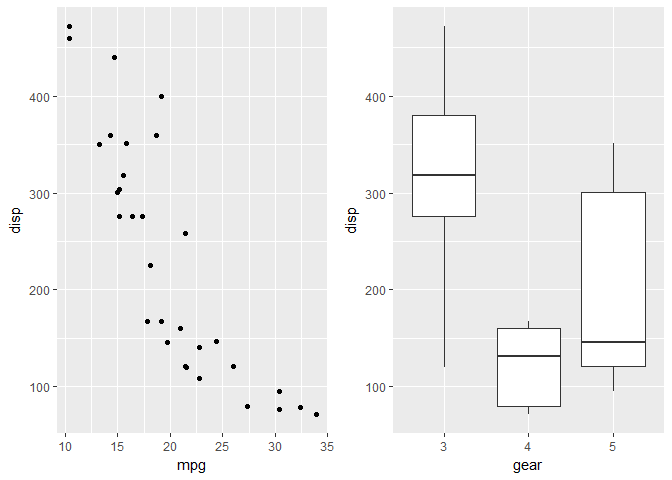
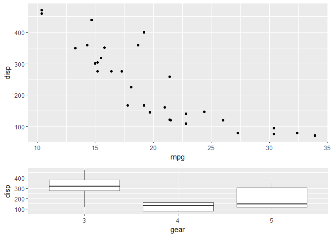
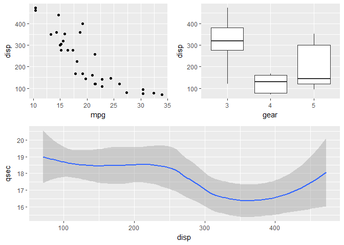
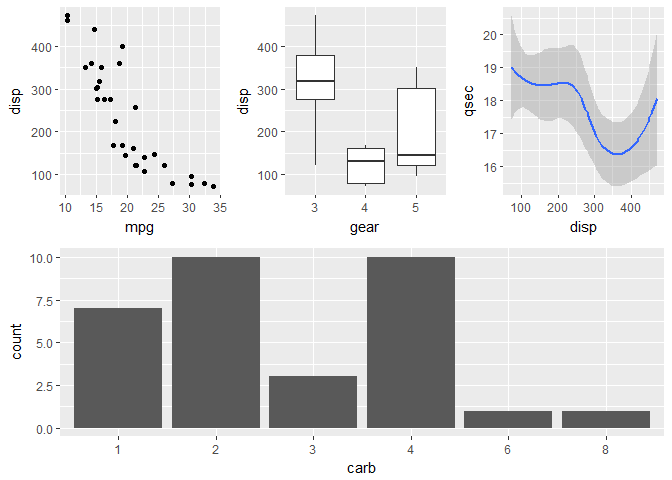
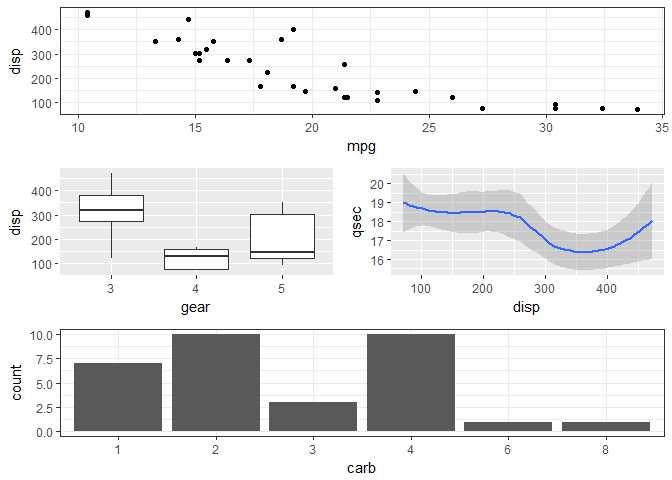
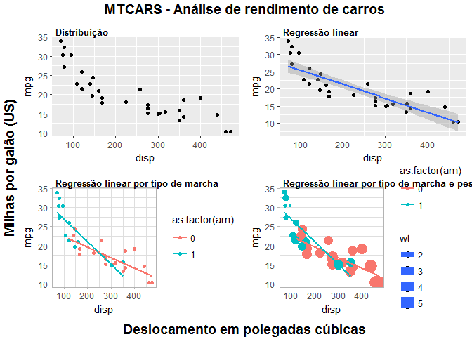

O arranjo de gráficos com ggplot tem sido um problema com soluções ainda em desenvolvimento. Neste tutorial vamos ver três pacotes que oferecem soluções diferentes.

O primero é o pacote recentemente  criado (novembro 2017), denominado "patchwork", os outros dois são o "grid" e o "cowplot", que oferecem soluções mais elaboradas, porém exigem mais conhecimento.

---

#### Pacote "patchwork"

Um novo pacote, ainda em desenvolvimento, foi criado por Thomas Lin Pedersen <https://github.com/thomasp85/patchwork> com o intuito de facilitar o arranjo de gráficos com ggplot.

Na sequência vamos apresentar a tradução do post de apresentação do pacote feito pelo autor (com pequenas modificações).

---

Exemplo

O uso de patchwork é simples como colocar os gráficos juntos!


```r
library(ggplot2)
library(patchwork)
mtcars$gear <- as.factor(mtcars$gear) # added 20180117
mtcars$carb <- as.factor(mtcars$carb) # added 20180117
p1 <- ggplot(mtcars) + geom_point(aes(mpg, disp))
p2 <- ggplot(mtcars) + geom_boxplot(aes(gear, disp, group = gear))

p1 + p2
```



Pode-se ainda colocar os gráficos juntos também usando o mesmo código ggplot:


```r
ggplot(mtcars) +
  geom_point(aes(mpg, disp)) +
  ggplot(mtcars) + 
  geom_boxplot(aes(gear, disp, group = gear))
```


---

Diferentes formatações de apresentação podem ser feitas, adicionando a função `plot_layout()`. Assim definimos as dimensôes e o espaço das diferentes linhas e colunas.


```r
p1 + p2 + plot_layout(ncol = 1, heights = c(3, 1))
```



Precisando de adicionar um espaço entre os gráfics, use `plot_spacer()` para preencher uma célula com espaço em branco (por enquanto sem possibilidade de definir o tamanho).

```r
p1 + plot_spacer() + p2
```


Podem ser feitos gráficos aninhados, envolvendo parte dos mesmos em parentesis (neste caso a apariência é modificada para os diferentes níveis desejados)


```r
p3 <- ggplot(mtcars) + geom_smooth(aes(disp, qsec))
p4 <- ggplot(mtcars) + geom_bar(aes(carb))

p4 + {
  p1 + {
    p2 +
      p3 +
      plot_layout(ncol = 1)
  }
} +
  plot_layout(ncol = 1)
```


---

Funções avançadas

Além de adicionar gráficos e apariências, patchwork define alguns outros operadores que podem ser de interesse.
Podemos querer adicionar "+" mais colocar a o lado direito e o esquerdo do gráfico no mesmo nível (diferente de colocar de colocá-los aninhados) Observe:


```r
# Todos os gráficos na mesma extensão...
p1 + p2 + p3 + plot_layout(ncol = 1) # posso usar nrow também
```


Isto é basicamente o mesmo que sem usar os parentêsis (como se fosse pura aritmética), os gráficos se adicionam no mesmo nível, mas agora olhe o seguinte:


```r
# dois primeiros gráficos no mesmo nível e o terceiro num segundo nível
p1 + p2 - p3 + plot_layout(ncol = 1)
```



_Uma note referente a semântica do pacote. Se "-" fosse lido como substraindo terá pouco sentido já que estariamos retirando gráficos, pense melhor que apenas um separador._

Para  colocar os gráficos um encima de outros ou do lado, patchwork tem tanto o operador "|" como "/" para dividir o espaço na horizontal ou na vertical respectivamente. Assim podemos combinar os gráficos numa sintaxe muito legível.


```r
(p1 | p2 | p3) /
      p4
```



Temos ainda dois operadores adicionais que tem um propósito levemente diferente, com a finalidade de reducir código. Pense no caso em que deseja cambiar o tema de todos os seus gráficos. Em vez de modificar sua apariência em forma individual, pode usar "&" ou "*" para adicionar elementos a todos os sub-gráficos de uma janela.

Os dois diferem em que "*" opera apenas no nível em que se encontra e "&" opera sobre todos os gráficos.


```r
(p1 + (p2 + p3) + p4 + plot_layout(ncol = 1)) * theme_bw()
```



enquanto "&" trabalha em todos os níveis:


```r
p1 + (p2 + p3) + p4 + plot_layout(ncol = 1) & theme_bw()
```


_Note que o parentesis é requerido no caso anterior devido a que "\*" tem preferência. O último caso apresentado é o mais comum e deve ser o de mais fácil uso._

Mais funcionalidade vão ir sendo adicionadas...

---

#### O pacote "grid"

O seguinte exemplo foi postado no grupo de ggplot2 do google (ggplot2@googlegroups.com), sendo uma das formas de arranjar vários gráficos de ggplot numa janela común.

Vamos plotar numa janela 4 gráficos, usando funções dos pacotes "grid" e "grid.Extra". Os dados são da base de dados _mtcars_.

##### Os gráficos que se desejam plotar...

---


```r
#
gplot1 <- ggplot(mtcars, aes(x= disp, y = mpg)) +
  geom_point() 

#
gplot2 <- ggplot(mtcars, aes(x= disp, y = mpg)) +
  geom_point()                                  +
  geom_smooth(method = "lm")

#
gplot3 <- ggplot(mtcars, aes(x= disp, y = mpg, colour = as.factor(am))) +
  geom_point()                                                          +
  geom_smooth(method = "lm", se = FALSE)                                +
  theme_light()

gplot4 <- ggplot(mtcars, aes(x= disp, y = mpg, colour = as.factor(am), size = wt)) +
  geom_point()                                                                     +
  geom_smooth(method = "lm", se = FALSE)                                           +
  theme_light()
```

---
  
#####  preparando os títulos comuns, funções do pacote "grid"

Usando a função _textGrob_, vamos criar três legendas, uma principal no topo da janela e duas para os eixos x e y.

---


```r
top    <- textGrob("MTCARS - Análise de rendimento de carros", 
                   gp = gpar(fontface = "bold", cex = 1.2))

bottom <- textGrob("Deslocamento em polegadas cúbicas", 
                   gp = gpar(fontface = "bold", cex = 1.2), hjust = 0.5)

left   <- textGrob("Milhas por galão (US)", 
                   gp = gpar(fontface = "bold", cex = 1.2), rot = 90)
```

---


```r
# preparando os gráficos individuais, função do pacote "gridExtra"
GPLOT1<-arrangeGrob(gplot1, top = textGrob("Distribuição", 
                                   x          = unit(0.17, "npc"), 
                                   y          = unit(0.30, "npc"), 
                                   just       = c("left", "top"), 
                                   gp         = gpar(col = "black", 
                                   fontsize   = 10, 
                                   fontface   = "bold", 
                                   fontfamily = "Times Roman")))

GPLOT2<-arrangeGrob(gplot2, top = textGrob("Regressão linear", 
                                   x          = unit(0.17, "npc"), 
                                   y          = unit(0.30, "npc"), 
                                   just       = c("left", "top"), 
                                   gp         = gpar(col = "black", 
                                   fontsize   = 10, 
                                   fontface   = "bold", 
                                   fontfamily = "Times Roman")))

GPLOT3<-arrangeGrob(gplot3, top = textGrob("Regressão linear por tipo de marcha", 
                                   x          = unit(0.17, "npc"), 
                                   y          = unit(0.30, "npc"), 
                                   just       = c("left", "top"), 
                                   gp         = gpar(col = "black", 
                                   fontsize   = 10, 
                                   fontface   = "bold", 
                                   fontfamily = "Times Roman")))

GPLOT4<-arrangeGrob(gplot4, top = textGrob("Regressão linear por tipo de marcha e peso", 
                                   x          = unit(0.17, "npc"), 
                                   y          = unit(0.30, "npc"), 
                                   just       =c("left","top"), 
                                   gp         =gpar(col = "black", 
                                   fontsize   = 10, 
                                   fontface   = "bold", 
                                   fontfamily  = "Times Roman")))
```

---

##### ordenando e graficando, função do pacote "gridExtra"

---


```r
grid.arrange(GPLOT1, 
             GPLOT2, 
             GPLOT3, 
             GPLOT4, 
             ncol   = 2, 
             bottom = bottom, 
             left   = left, 
             top    = top)
```



---

#### Pacote "cowplot"

Veja o tutorial de cowplot

---


```r
library(cowplot)
plot_grid(GPLOT1, 
          GPLOT2,
          GPLOT3,
          GPLOT4, 
          labels = c("(A)", 
                     "(B)",
                     "(C)", 
                     "(D)"), 
          ncol   = 2, 
          nrow   = 2)
```


---

FIM DO TUTORIAL

