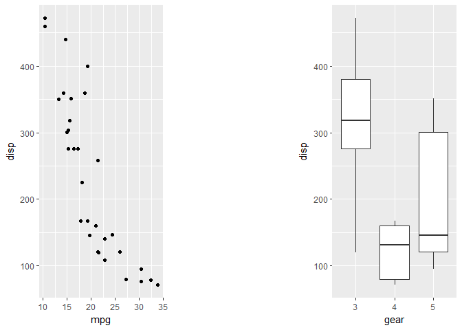
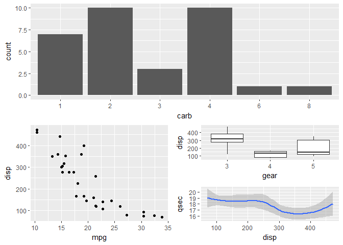
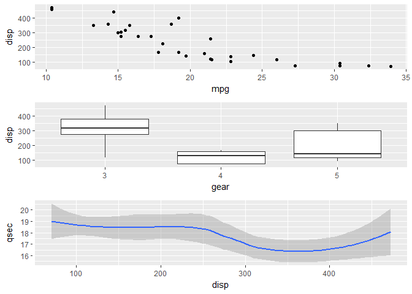
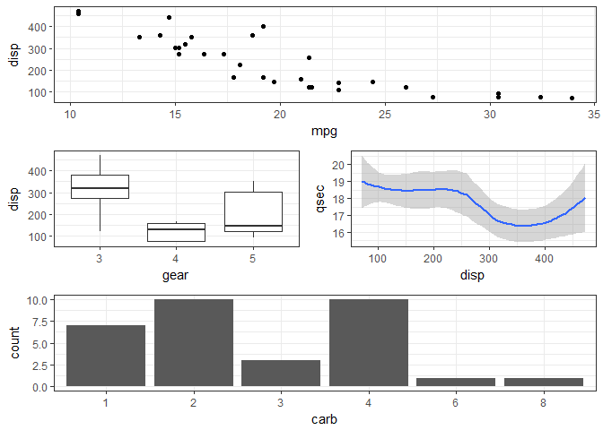
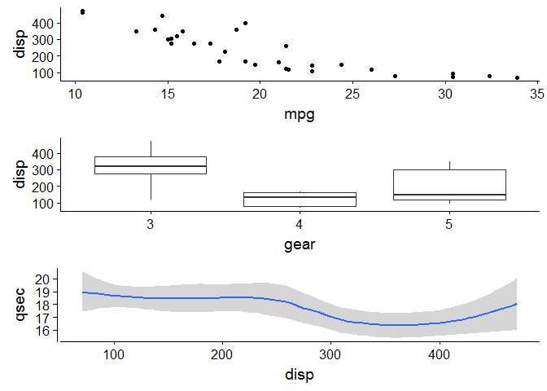
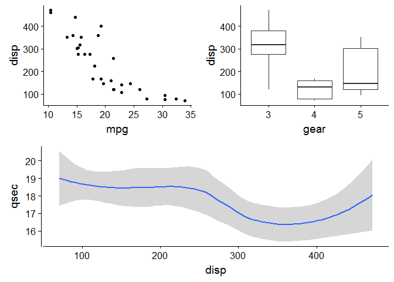
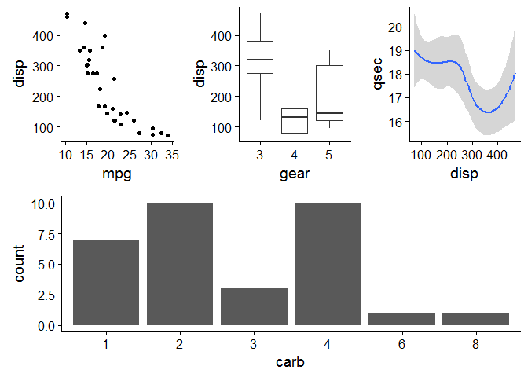

O seguinte exemplo foi postado no grupo de ggplot2 do google (ggplot2@googlegroups.com), sendo uma das formas de arranjar vários gráficos de ggplot numa janela común.

No exemplo vamos plotar numa janela 4 gráficos, usando funções dos pacotes "grid" e "grid.Extra". Os dados são da base de dados _mtcars_.

#### Os gráficos que se desejam plotar...

---


```r
#
gplot1 <- ggplot(mtcars, aes(x= disp, y = mpg)) +
  geom_point() 

#
gplot2 <- ggplot(mtcars, aes(x= disp, y = mpg)) +
  geom_point()                                  +
  geom_smooth(method = "lm")

#
gplot3 <- ggplot(mtcars, aes(x= disp, y = mpg, colour = as.factor(am))) +
  geom_point()                                                          +
  geom_smooth(method = "lm", se = FALSE)                                +
  theme_light()

gplot4 <- ggplot(mtcars, aes(x= disp, y = mpg, colour = as.factor(am), size = wt)) +
  geom_point()                                                                     +
  geom_smooth(method = "lm", se = FALSE)                                           +
  theme_light()
```

---
  
####  preparando os títulos comuns, funções do pacote "grid"

Usando a função _textGrob_, vamos criar três legendas, uma principal no topo da janela e duas para os eixos x e y.

---


```r
top    <- textGrob("MTCARS - Análise de rendimento de carros", 
                   gp = gpar(fontface = "bold", cex = 1.2))

bottom <- textGrob("Deslocamento em polegadas cúbicas", 
                   gp = gpar(fontface = "bold", cex = 1.2), hjust = 0.5)

left   <- textGrob("Milhas por galão (US)", 
                   gp = gpar(fontface = "bold", cex = 1.2), rot = 90)
```

---


```r
# preparando os gráficos individuais, função do pacote "gridExtra"
GPLOT1<-arrangeGrob(gplot1, top = textGrob("Distribuição", 
                                   x          = unit(0.17, "npc"), 
                                   y          = unit(0.30, "npc"), 
                                   just       = c("left", "top"), 
                                   gp         = gpar(col = "black", 
                                   fontsize   = 10, 
                                   fontface   = "bold", 
                                   fontfamily = "Times Roman")))

GPLOT2<-arrangeGrob(gplot2, top = textGrob("Regressão linear", 
                                   x          = unit(0.17, "npc"), 
                                   y          = unit(0.30, "npc"), 
                                   just       = c("left", "top"), 
                                   gp         = gpar(col = "black", 
                                   fontsize   = 10, 
                                   fontface   = "bold", 
                                   fontfamily = "Times Roman")))

GPLOT3<-arrangeGrob(gplot3, top = textGrob("Regressão linear por tipo de marcha", 
                                   x          = unit(0.17, "npc"), 
                                   y          = unit(0.30, "npc"), 
                                   just       = c("left", "top"), 
                                   gp         = gpar(col = "black", 
                                   fontsize   = 10, 
                                   fontface   = "bold", 
                                   fontfamily = "Times Roman")))

GPLOT4<-arrangeGrob(gplot4, top = textGrob("Regressão linear por tipo de marcha e peso", 
                                   x          = unit(0.17, "npc"), 
                                   y          = unit(0.30, "npc"), 
                                   just       =c("left","top"), 
                                   gp         =gpar(col = "black", 
                                   fontsize   = 10, 
                                   fontface   = "bold", 
                                   fontfamily  = "Times Roman")))
```

---

#### ordenando e graficando, função do pacote gridExtra

---


```r
grid.arrange(GPLOT1, 
             GPLOT2, 
             GPLOT3, 
             GPLOT4, 
             ncol   = 2, 
             bottom = bottom, 
             left   = left, 
             top    = top)
```

<!-- -->

---

#### Pacote "cowplot"

Veja tutorial de cowplot

---


```r
library(cowplot)
```

```
## 
## Attaching package: 'cowplot'
```

```
## The following object is masked from 'package:ggplot2':
## 
##     ggsave
```

```r
plot_grid(GPLOT1, 
          GPLOT2,
          GPLOT3,
          GPLOT4, 
          labels = c("(A)", 
                     "(B)",
                     "(C)", 
                     "(D)"), 
          ncol   = 2, 
          nrow   = 2)
```

<!-- -->

---

#### Pacote "patchwork"

Um novo pacote, ainda em desenvolvimento, foi criado por Thomas Lin Pedersen <https://github.com/thomasp85/patchwork> com o intuito de facilitar o arranjo de gráficos com ggplot.

Na sequência vamos apresentar a tradução do post de apresentação do pacote feito pelo autor.

---

Exemplo

O uso de patchwork é simples como colocar os gráficos juntos!


```r
library(ggplot2)
library(patchwork)
mtcars$gear <- as.factor(mtcars$gear) # added 20180117
mtcars$carb <- as.factor(mtcars$carb) # added 20180117
p1 <- ggplot(mtcars) + geom_point(aes(mpg, disp))
p2 <- ggplot(mtcars) + geom_boxplot(aes(gear, disp, group = gear))

p1 + p2
```

<!-- -->

Pode-se ainda colocar os gráficos juntos também usando o mesmo código ggplot:


```r
ggplot(mtcars) +
  geom_point(aes(mpg, disp)) +
  ggplot(mtcars) + 
  geom_boxplot(aes(gear, disp, group = gear))
```

<!-- -->

---

Diferentes formatações de apresentação podem ser feitas, adicionando a função `plot_layout()`. Assim definimos as dimensôes e o espaço das diferentes linhas e colunas.


```r
p1 + p2 + plot_layout(ncol = 1, heights = c(3, 1))
```

<!-- -->

f you need to add a bit of space between your plots you can use plot_spacer() to fill a cell in the grid with nothing


```r
p1 + plot_spacer() + p2
```

<!-- -->

You can make nested plots layout by wrapping part of the plots in parentheses - in these cases the layout is scoped to the different nesting levels


```r
p3 <- ggplot(mtcars) + geom_smooth(aes(disp, qsec))
p4 <- ggplot(mtcars) + geom_bar(aes(carb))

p4 + {
  p1 + {
    p2 +
      p3 +
      plot_layout(ncol = 1)
  }
} +
  plot_layout(ncol = 1)
```

```
## `geom_smooth()` using method = 'loess' and formula 'y ~ x'
```

<!-- -->

Advanced features

In addition to adding plots and layouts together, patchwork defines some other operators that might be of interest. - will behave like + but put the left and right side in the same nesting level (as opposed to putting the right side into the left sides nesting level). Observe:


```r
p1 + p2 + p3 + plot_layout(ncol = 1)
```

```
## `geom_smooth()` using method = 'loess' and formula 'y ~ x'
```

<!-- -->

this is basically the same as without braces (just like standard math arithmetic) - the plots are added sequentially to the same nesting level. Now look:


```r
p1 + p2 - p3 + plot_layout(ncol = 1)
```

```
## `geom_smooth()` using method = 'loess' and formula 'y ~ x'
```

<!-- -->

Now p1 + p2 and p3 is on the same level...

_A note on semantics. If - is read as subtrack its use makes little sense as we are not removing plots. Think of it as a hyphen instead..._

Often you are interested in just putting plots besides or on top of each other. patchwork provides both | and / for horizontal and vertical layouts respectively. They can of course be combined for a very readable layout syntax:


```r
(p1 | p2 | p3) /
      p4
```

```
## `geom_smooth()` using method = 'loess' and formula 'y ~ x'
```

<!-- -->

There are two additional operators that are used for a slightly different purpose, namely to reduce code repetition. Consider the case where you want to change the theme for all plots in an assemble. Instead of modifying all plots individually you can use & or \* to add elements to all subplots. The two differ in that * will only affect the plots on the current nesting level:


```r
(p1 + (p2 + p3) + p4 + plot_layout(ncol = 1)) * theme_bw()
```

```
## `geom_smooth()` using method = 'loess' and formula 'y ~ x'
```

<!-- -->

whereas & will recurse into nested levels:


```r
p1 + (p2 + p3) + p4 + plot_layout(ncol = 1) & theme_bw()
```

```
## `geom_smooth()` using method = 'loess' and formula 'y ~ x'
```

<!-- -->

_Note that parenthesis is required in the former case due to higher precedence of the * operator. The latter case is the most common so it has deserved the easiest use._

This is all it does for now, but stay tuned as more functionality is added, such as collapsing guides, etc...


